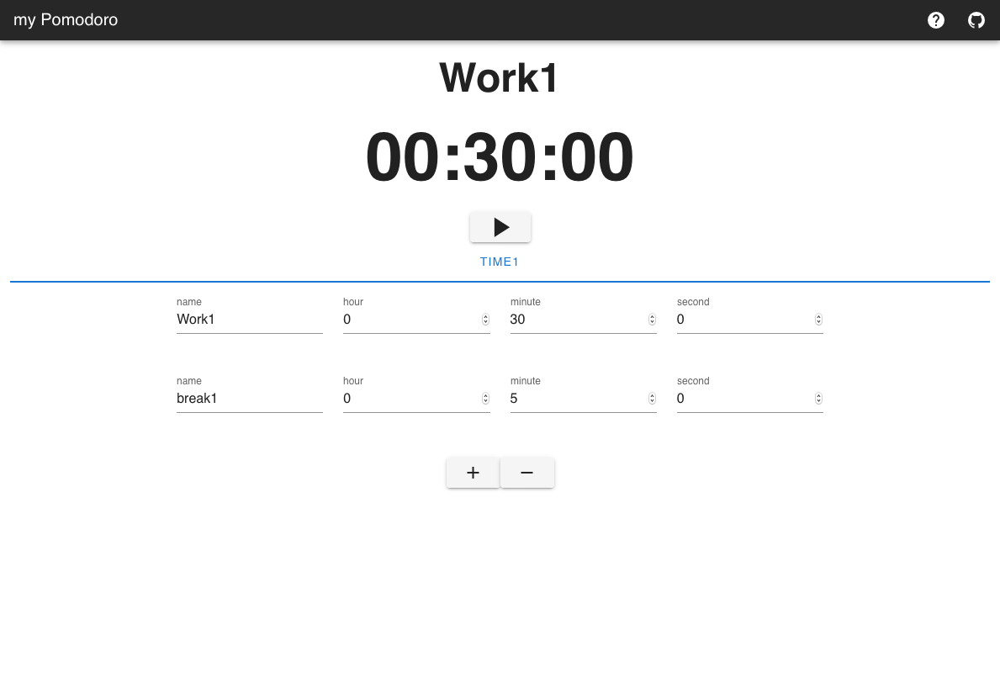
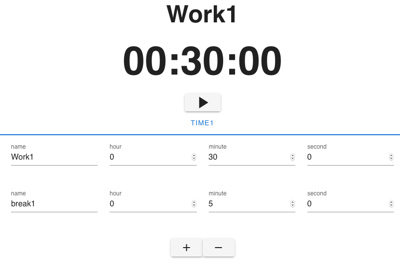
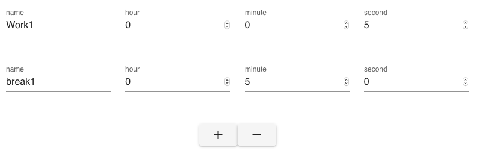
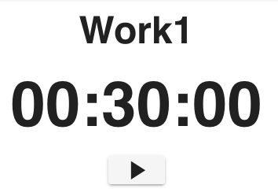
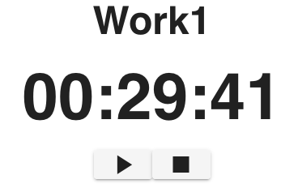
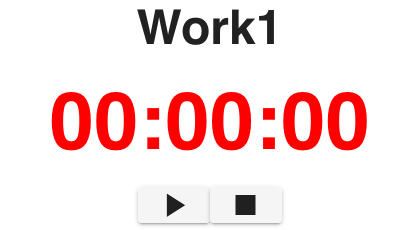

# my Pomodoro Timer

URL： [https://mypomodorotimer.netlify.app/](https://mypomodorotimer.netlify.app/)

## 概要



このアプリは、自分で作った1セットをカウントダウンしてくれるタイマーアプリです。

ポモドーロテクニックってご存知でしょうか？
30分タスクをこなして、5分休憩を1セットとする時間管理術です。
それを自動でやってくれるアプリも多く存在します。

しかし、このセットを外すと、自分で時間管理を意識しないといけません。
在宅勤務で生産性が求められる昨今、自分の意識と時間は、なるべくタスクに割きたいものです。
仕事だけではなく、Aを1分やってBを2分やるということは、日常生活に多く存在すると思います。
これはそういう個人の作業の時間管理を手助けするアプリです。

## 使用技術など

### 言語・フレームワーク

- Vue.js
- Vuetify

### ホスティング先

- Netlify

## 使い方

画面上部がタイマーで、画面下部がタイマー設定です。
初期設定は、ポモドーロタイマーが設定されています。
開始ボタンをクリックすることで、カウントダウンを開始します。


### 時間の設定

タイマー名から、時分秒まで、自由で変更可能です。
値を変更したタイミングで、随時設定は保存されていきます。
「＋」ボタンで、新しいタイマーを追加します。
「ー」ボタンで、一番最後のタイマーを削除します。
（画像を例にすると、break1のタイマーが削除されます）


### タイマーの状態

タイマー停止状態
タイマーは動いていません。この状態でのみ設定を変更できます。
ボタンは開始ボタンの1つしか表示されていません。
ボタンを押すことで、カウントダウンが始まり、稼働状態に移行します。



### タイマー稼働状態

カウントダウン中です。
ボタンは一時停止ボタンの1つしか表示されていません。
ボタンを押すことで、カウントダウンが止まり、一時停止状態に移行します。


### タイマー一時停止状態

一時停止中です。
ボタンは再開と停止ボタンの2つしか表示されていません。
再開ボタンを押すことで、カウントダウンが再開され、タイマー稼働状態に移行します。
停止ボタンを押すことで、カウントダウンは中止され、タイマー停止状態に移行します。タイマーの名前と時間は、設定の一番上に設定されます。


### タイマー終了状態

カウントダウンが終了しました。
終了したことを、アラーム音声で知らせます。
スマートフォンの場合、加えて振動でカウントダウン終了を知らせます。
表示されるボタンと挙動は、一時停止状態と同じです。


## オンプレミス環境でのセットアップ方法

Dockerfileを、ビルドすることで、ローカル環境またはオンプレミス環境で、my Pomodoro Timerを動かすことができます。

```bash
$ git clone https://github.com/EndoHizumi/myPomodoro.git
$ cd mypomodoro
$ docker build -t my_pomodoro:latest .
$ docker run -p 8080:8080 --rm --name mypomodoro  my_pomodoro
```

